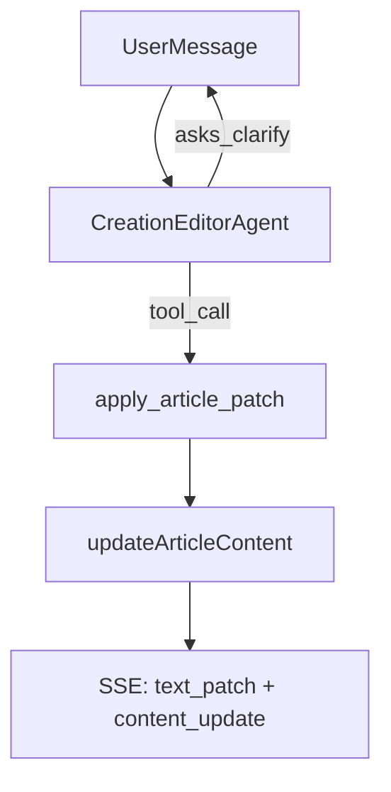

# Article Editor Agent Plan

## Key design decisions

- **Agent style**: reuse LangGraph/tool/checkpoint pattern from `qaAgent` so the editor supports multi-turn clarification and tool calls.
- **Article storage**: keep the article as a plain string (no draft schema).
- **Patch format**: literal `pattern` + `replacement`, apply **first match only**.
- **Persistence + SSE**: after each patch, update article content via `updateArticleContent()` and stream SSE with patch + full content so the frontend stays in sync.

## What to build

1. **Text patch helper**
  - Add a helper that applies `{pattern, replacement}` to the article string using **literal** matching and **first match only**.
  - Use existing `updateArticleContent()` in `src/server/services/creationService.ts` to persist updated content.
2. **Creation editor agent (LangGraph)**
  - Create `src/server/domain/agent/creationEditorAgent.ts` modeled after `qaAgent` for system prompt loading, checkpointing, and tool loop.
  - Tools to expose:
    - `get_article_content` (load article string)
    - `set_article_content` (set full article string for initial creation)
    - `apply_article_patch` (apply text patch, persist via `updateArticleContent`, return patch + new content)
    - `set_article_metadata` (optional: title/status/summary)
    - `retrieve_knowledge` (reuse from QA if you want the editor to reference sources)
  - Agent prompt should instruct it to **ask the user about structure/topic/core content** and only call tools to update the article string, not to output full article directly.
3. **Streaming API (SSE)**
  - Add a new route like `src/app/api/projects/[project_id]/creations/[creation_id]/editor/stream/route.ts` to accept a user message and stream agent events.
  - Stream events should include:
    - `assistant_message` chunks (for chat UI)
    - `text_patch` events (`pattern` + `replacement`)
    - `content_update` events (full article string after patch)
  - **Note**: when `apply_article_patch` updates the server-side article, it must also push `text_patch` + `content_update` through this SSE channel.
  - Reuse `thread_id` from creation to continue the same agent state (see `creationService` and `creationRepo` for thread handling).
4. **Create/Update interfaces**
  - **New API**: `POST /api/projects/:project_id/creations/:creation_id/editor/stream` (SSE stream of agent events)
  - **Optional**: `GET /api/projects/:project_id/creations/:creation_id/editor/state` to fetch current article string if needed by frontend.
  - **No breaking changes** to existing creation list/detail endpoints.

## Files to touch

- New: `src/server/domain/agent/creationEditorAgent.ts`
- New: `src/server/domain/agent/textPatch.ts` (literal patch helper)
- Update: `src/server/services/creationService.ts` (helpers to load/persist article string + message logging if needed)
- New API route: `src/app/api/projects/[project_id]/creations/[creation_id]/editor/stream/route.ts`
- (Optional) Update `src/client/agent/creationClient.ts` to call SSE stream endpoint

## Relevant existing code

- `qaAgent` LangGraph pattern: `/Users/jychen/Work/mem-write/src/server/domain/agent/qaAgent.ts`
- Article persistence: `/Users/jychen/Work/mem-write/src/server/services/creationService.ts`
- Creation messages: `/Users/jychen/Work/mem-write/src/app/api/projects/[project_id]/creations/[creation_id]/messages/route.ts`

## Text patch flow (conceptual)

